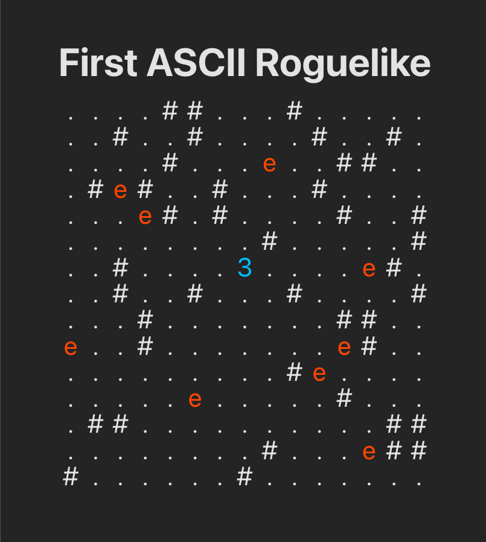

# first-ascii-roguelike

Simple ASCII roguelike game based on game logic from this tutorial: [How to Make Your First Roguelike | Envato Tuts+](https://code.tutsplus.com/how-to-make-your-first-roguelike--gamedev-13677t).
I only updated the logic with TypeScript and added an UI with Preact and CSS grid.

Simply install dependencies with `npm install` and run the game with `npm start`.

